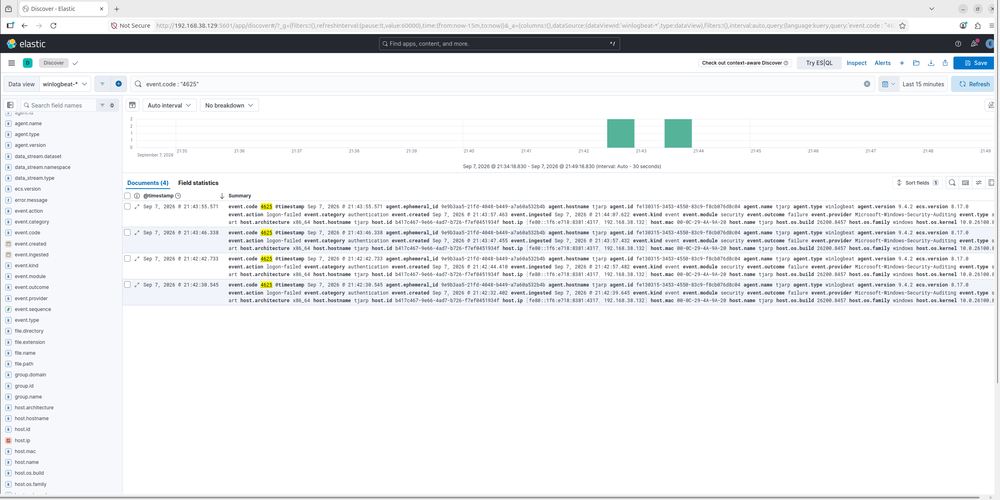

# Phase 2: Attack Simulation & Detection (RDP Brute-Force)

## Objective
Simulate a real network-based attack from the Kali attacker machine against the Windows host, and validate that the SIEM detects it — moving from passive log collection to active threat detection.

## Environment

| Component | IP |
|---|---|
| Ubuntu (SIEM) | 192.168.38.129 |
| Kali (Attacker) | 192.168.38.131 |
| Windows 11 (Target) | 192.168.38.132 |

## Attack Scenario: RDP Brute-Force

**Technique simulated:** Remote Desktop Protocol (RDP) brute-force login attempts — a common real-world attack technique used to gain unauthorized access via weak or guessed credentials.

### Steps
1. Enabled RDP on the Windows target and confirmed the service was reachable from Kali via an Nmap scan (port 3389 open).
2. From Kali, used `xfreerdp` to attempt multiple RDP logins with incorrect credentials, simulating a brute-force attempt.
3. Each failed attempt was logged on Windows as **Event ID 4625** (Security: An account failed to log on) and forwarded to Elasticsearch via Winlogbeat.

## Detection

Queried Kibana Discover for `event.code: "4625"` and confirmed all 4 simulated login attempts were captured in near real-time, each with full context (timestamp, source, authentication provider).

Built a Kibana Lens visualization plotting failed logon attempts over time, added to the **SOC Homelab** dashboard alongside the baseline activity chart from Phase 1.

## Outcome

- Confirmed end-to-end detection pipeline: **attack → Windows event log → Winlogbeat → Elasticsearch → Kibana visualization**
- Dashboard now shows both normal baseline activity and a clear spike corresponding to the simulated attack
- Demonstrates the full value chain of a SIEM: not just collecting logs, but turning them into actionable detection

## Next Phase
Build a formal Kibana alerting rule to automatically flag repeated failed logons (e.g., 3+ failures within 5 minutes) instead of relying on manual dashboard review.
